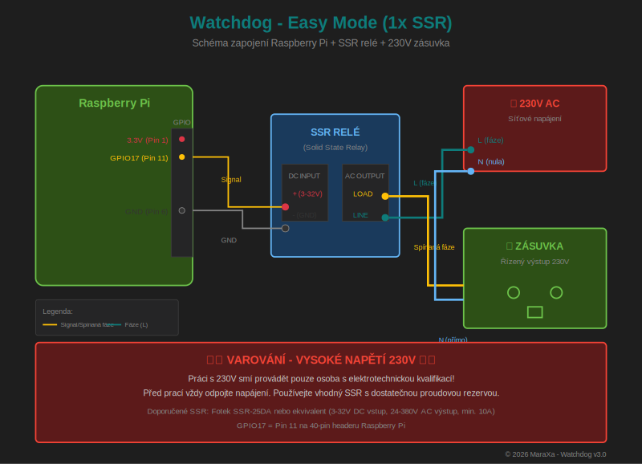
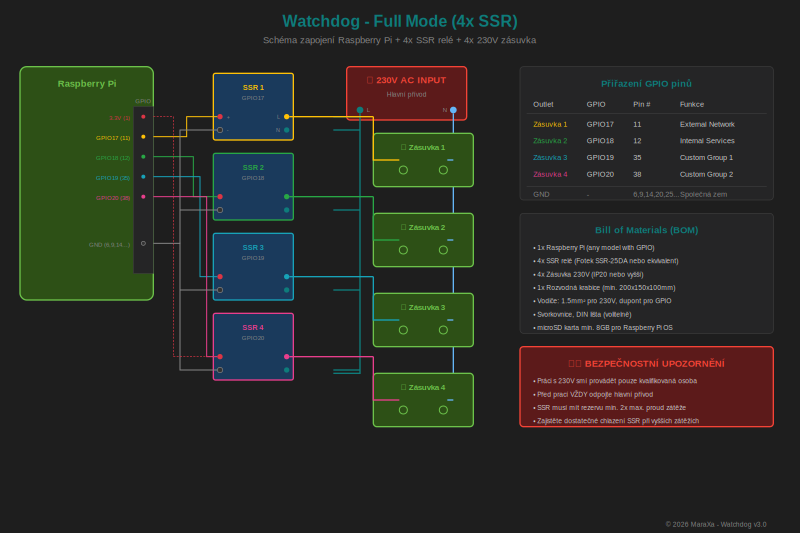

# Watchdog v1.0

**Network Monitoring System with Automatic Power Reset**

Watchdog is a professional network monitoring solution for Raspberry Pi that automatically restarts unresponsive devices via GPIO-controlled power outlets (SSR relays).

[](https://github.com/MaraXa-CZ/watchdog/releases)


## Features

### Core Functionality
- 🔍 **Network Monitoring** - Continuous ping monitoring of servers/devices
- ⚡ **Automatic Power Reset** - GPIO-controlled SSR relay switching
- 📊 **Statistics & Charts** - Ping history, uptime percentage, response times
- 📅 **Scheduled Restarts** - Per-group scheduled maintenance restarts

### Multi-User System
- 👤 **Role-Based Access Control**
  - **Admin** - Full system access
  - **Operator** - Can control relays, view logs (no config access)
  - **Viewer** - Read-only access to dashboard and logs

### Internationalization
- 🌍 **Multi-Language** - English and Czech (easily extensible)
- 🕐 **Timezone Support** - Configurable timezone with NTP sync

### Security & Reliability
- 🔒 **SSL/HTTPS Support** - Optional encrypted connections
- 📋 **Audit Logging** - Track all user actions
- 💾 **Auto-Backup** - Configuration backup on every change
- 🔄 **Config Migration** - Automatic upgrade from older versions

### Mobile & API
- 📱 **Mobile PWA** - Progressive Web App for iOS/Android
- 🔌 **REST API** - Full API access with token authentication

### Hardware
- 🔧 **Up to 16 Outlets** - Support for 16 GPIO-controlled power outlets
- 🖥️ **Pi 1-5 Support** - Compatible with all Raspberry Pi models

---

## Supported Hardware

| Raspberry Pi | Status | Notes |
|--------------|--------|-------|
| Pi 5 | ✅ Full support | lgpio/gpiod backend |
| Pi 4 / 400 | ✅ Full support | RPi.GPIO/gpiozero |
| Pi 3 / 3B+ | ✅ Full support | RPi.GPIO/gpiozero |
| Pi Zero 2 W | ✅ Full support | RPi.GPIO/gpiozero |
| Pi 2 | ✅ Full support | RPi.GPIO/gpiozero |
| Pi 1 / Zero | ⚠️ Limited | Slower, but works |

## Supported OS

| OS | Version | Codename | Status |
|----|---------|----------|--------|
| Raspberry Pi OS | 11 | Bullseye | ✅ Full support |
| Raspberry Pi OS | 12 | Bookworm | ✅ Full support |
| Raspberry Pi OS | 13 | Trixie | ✅ Full support |
| Ubuntu Server | 22.04 | Jammy | ✅ Full support |
| Ubuntu Server | 24.04 | Noble | ✅ Full support |
| DietPi | - | - | ✅ Full support |

### GPIO Backend Auto-Detection

Watchdog automatically selects the best GPIO library:

| OS / Hardware | Primary Backend | Fallback |
|---------------|-----------------|----------|
| Trixie (13+) | gpiod | lgpio → gpiozero |
| Pi 5 + Bookworm | lgpio | gpiod → gpiozero |
| Pi 1-4 + Bullseye/Bookworm | gpiozero | lgpio → gpiod |

### Network Backend Auto-Detection

| OS | Network Manager |
|----|-----------------|
| Trixie (13+) | NetworkManager (nmcli) |
| Bookworm/Bullseye | dhcpcd |
| Ubuntu | netplan |

---

## Requirements

### Hardware
- Raspberry Pi (any model: 1, 2, 3, 4, 5, Zero, Zero 2 W)
- SSR (Solid State Relay) modules (e.g., Fotek SSR-25DA)
- MicroSD card (8GB+ recommended)
- Network connection

### Software
- Raspberry Pi OS (Bullseye, Bookworm, or Trixie)
- Python 3.9+

---

## Installation

### Fresh Install

```bash
cd /opt
sudo git clone https://github.com/MaraXa-CZ/watchdog.git
cd watchdog
sudo bash install.sh
```

The installer will:
1. Detect your OS and Pi model
2. Install dependencies (Flask, GPIO libraries)
3. Optionally configure static IP
4. Create admin user
5. Start services

### Update Existing Installation

```bash
cd /opt/watchdog
sudo git pull
sudo bash install.sh
sudo systemctl restart watchdog watchdog-web
```

### First Login

- **URL**: `http://<raspberry-ip>/`
- **Username**: `admin`
- **Password**: (set during installation, default: `admin`)

⚠️ **Change the default password immediately after first login!**

---

## Configuration

### GPIO Pin Assignment

| GPIO | Physical Pin | Recommended |
|------|--------------|-------------|
| 17, 18, 27, 22 | 11, 12, 13, 15 | ✅ Safe - Default outlets |
| 23, 24, 25, 26 | 16, 18, 22, 37 | ✅ Safe |
| 5, 6, 12, 13, 16 | 29, 31, 32, 33, 36 | ✅ Safe |
| 4 | 7 | ✅ Safe (1-Wire if unused) |
| 2, 3 | 3, 5 | ⚠️ I2C (if unused) |
| 7-11 | Various | ⚠️ SPI (if unused) |
| 14, 15 | 8, 10 | ⚠️ UART (if unused) |

### Wiring Diagrams

#### Basic Setup (1 SSR Relay)



#### Full Setup (4 SSR Relays)



#### Connection Principle

```
Raspberry Pi          SSR Relay           Load (230V)
────────────          ─────────           ───────────
GPIO Pin ────────────► DC+ (3-32V)
GND      ────────────► DC-

                      AC Load ────────────► Device
                      AC Live ◄──────────── Mains L
                      (N passes through directly to device)
```

⚠️ **WARNING**: Working with mains voltage (230V) is dangerous! If you are not qualified, consult an electrician.

### Example Configuration

```json
{
  "outlets": {
    "outlet_1": {"name": "Server Rack 1", "gpio_pin": 17, "active_high": true},
    "outlet_2": {"name": "Network Switch", "gpio_pin": 18, "active_high": true},
    "outlet_3": {"name": "Router", "gpio_pin": 27, "active_high": true},
    "outlet_4": {"name": "NAS", "gpio_pin": 22, "active_high": true}
  },
  "groups": [
    {
      "name": "Web Servers",
      "servers": ["192.168.1.10", "192.168.1.11"],
      "outlet": "outlet_1",
      "fail_count": 3,
      "off_time": 10,
      "enabled": true
    }
  ]
}
```

---

## User Roles

| Permission | Admin | Operator | Viewer |
|------------|:-----:|:--------:|:------:|
| View Dashboard | ✅ | ✅ | ✅ |
| View Logs | ✅ | ✅ | ✅ |
| View Statistics | ✅ | ✅ | ✅ |
| Control Relays | ✅ | ✅ | ❌ |
| Configure Groups | ✅ | ❌ | ❌ |
| Manage Users | ✅ | ❌ | ❌ |
| System Settings | ✅ | ❌ | ❌ |
| View Audit Log | ✅ | ❌ | ❌ |

---

## Mobile App

Watchdog includes a Progressive Web App (PWA) that works on any smartphone:

1. Open `http://<raspberry-ip>/mobile/` in your browser
2. **Chrome (Android)**: Menu → "Add to Home screen"
3. **Safari (iOS)**: Share → "Add to Home Screen"

The app provides:
- Real-time group status
- Relay control (for operators and admins)
- Offline indicator
- Auto-refresh

---

## API Reference

### Authentication

```bash
curl -X POST http://watchdog/api/auth \
  -H "Content-Type: application/json" \
  -d '{"username": "admin", "password": "admin"}'
```

Response:
```json
{
  "success": true,
  "token": "abc123...",
  "user": {"username": "admin", "role": "admin"}
}
```

### Get Groups

```bash
curl http://watchdog/api/groups \
  -H "Authorization: Bearer <token>"
```

### Control Relay

```bash
curl -X POST http://watchdog/api/control \
  -H "Authorization: Bearer <token>" \
  -H "Content-Type: application/json" \
  -d '{"group": "Web Servers", "action": "restart"}'
```

Actions: `on`, `off`, `restart`

---

## File Structure

```
/opt/watchdog/
├── app.py              # Web application
├── watchdog.py         # Monitoring daemon
├── gpio_manager.py     # Multi-backend GPIO control
├── network_manager.py  # Network configuration
├── config.json         # Configuration
├── users.json          # User database
├── log/                # System logs
├── stats/              # Ping statistics
├── backups/            # Config backups
├── ssl/                # SSL certificates
├── templates/          # HTML templates
├── mobile/             # Mobile PWA
└── docs/               # Documentation
```

---

## Service Management

```bash
# Status
sudo systemctl status watchdog watchdog-web

# Restart
sudo systemctl restart watchdog watchdog-web

# View logs
journalctl -u watchdog -f
journalctl -u watchdog-web -f

# Stop
sudo systemctl stop watchdog watchdog-web
```

---

## Useful Scripts

### Reset Password

```bash
sudo bash /opt/watchdog/reset_password.sh
```

### Uninstall

```bash
sudo bash /opt/watchdog/uninstall.sh
```

---

## Troubleshooting

### Services won't start

```bash
# Check logs
journalctl -u watchdog -n 100
journalctl -u watchdog-web -n 100

# Test manually
cd /opt/watchdog
sudo python3 watchdog.py
```

### GPIO not working

1. Verify wiring connections
2. Check GPIO permissions: `sudo usermod -aG gpio $USER`
3. For Pi 5 on Bookworm, ensure lgpio is installed: `sudo apt install python3-lgpio`
4. For Trixie, ensure gpiod is installed: `sudo apt install python3-libgpiod`

### Web interface not accessible

1. Check if service is running: `systemctl status watchdog-web`
2. Check firewall: `sudo ufw allow 80`
3. Verify IP address: `hostname -I`

### Network configuration not working

1. Check network type: `systemctl is-active NetworkManager dhcpcd`
2. For Trixie: NetworkManager is used
3. For Bookworm/Bullseye: dhcpcd is used
4. For Ubuntu: netplan is used

---

## Changelog

### v1.0 - Initial Release
- 🎉 **First public release**
- ✅ Universal OS support (Bullseye, Bookworm, Trixie)
- ✅ Multi GPIO backend (gpiod, lgpio, RPi.GPIO)
- ✅ Multi network backend (NetworkManager, dhcpcd, netplan)
- ✅ Full Pi 5 support
- ✅ Auto-detection of hardware and OS
- ✅ Clean installation without legacy scripts

---

## License

MIT License - see [LICENSE.txt](LICENSE.txt)

## Author

© 2025 MaraXa

## Support

- Documentation: `docs/` folder
- Issues: GitHub Issues
